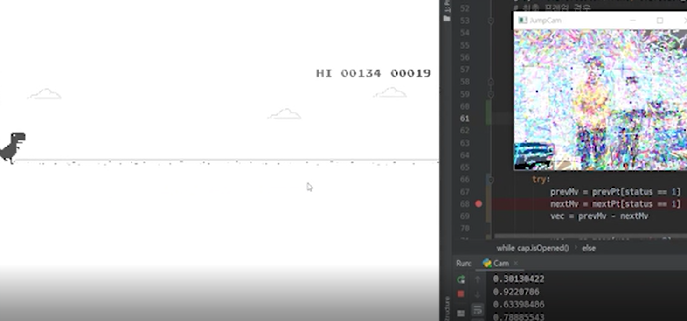

# CameraDino

## Play chrome dino with camera
This is a JUMP detection using optical flow.

## [[Blog]Algorithms](https://shsongs.github.io/CameraDino/)
## How To Play
1. Chrominm address bar  
```
chrome://dino/
```
2. Excute python
```
python Game.py
```
3. Focus Chrome dino game page

### Demo
#### Raspberry Pi 4
  
  

#### Intel laptop
  


## Dependencies
python3 
```
OpenCV
pynput
```
Chorme